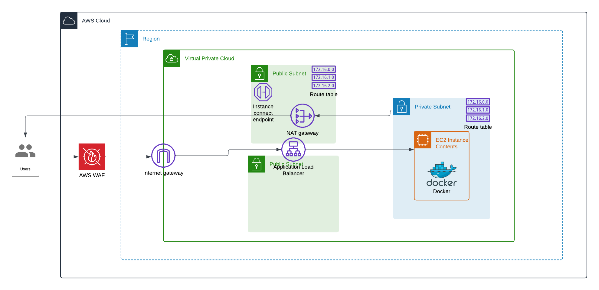

# TerraformNginx

## Overview

This project demonstrates the deployment of a containerized NGINX Docker image on an Amazon EC2 instance using Terraform. The setup is fully automated with Terraform and includes building and running an NGINX Docker container on an EC2 instance.

## Project Structure

- `Dockerfile`: The Dockerfile used to build the custom NGINX Docker image.
- `main.tf`: The Terraform configuration file for provisioning the AWS infrastructure.
- `index.html`: A sample HTML file served by the NGINX container.


## Prerequisites

- Terraform installed on your local machine.
- AWS CLI configured with appropriate credentials.
- An AWS account.

## Getting Started

1. **Clone the Repository**

   ```bash
   git clone https://github.com/Talh12/TerraformNginx.git
   cd TerraformNginx

2. **Configure Terraform**
Edit main.tf to include your AWS region and any other necessary configurations.

use the command aws cofigure and add your credentials and your default region name 

3. **Build the Docker Image**

Build the Docker image from the Dockerfile:

```
docker build -t my-nginx-image .
```

4. **Initialize Terraform**

Initialize the Terraform working directory:

```
terraform init
```

5. **Apply the Terraform Configuration**
Apply the configuration to create the AWS resources:

```
terraform apply -auto-aprove
```
Confirm the action when prompted.

6. **Access the NGINX Server**

After deployment, Terraform will output the DNS name of the application load balancer. Use this DNS address to access the NGINX server in your web browser.


7. **Destroy the Infrastructure (Optional)**

To remove all resources created by Terraform, run:

```
terraform destroy -auto-aprove
```

Confirm the action when prompted.

## Automated Deployment with GitHub Actions

### Overview

This project uses GitHub Actions to automate the deployment of the containerized NGINX application to AWS. The workflow defined in .github/workflows/deploy.yml ensures that infrastructure changes are applied automatically upon commits to the main branch.

### GitHub Actions Workflow

The workflow automates the following steps:

1. Code Checkout: Retrieves the latest version of the code from the repository.
2. Terraform Setup: Installs Terraform on the runner.
3. Terraform Initialization: Initializes the Terraform working directory.
4. Terraform Apply: Applies the Terraform configuration to provision or update the AWS resources.

## How It Works

1. Triggering the Workflow:
* The workflow is triggered on every push to the main branch.

2. Checkout Code:
* Uses the actions/checkout action to pull the latest code from the repository.

3. Set Up Terraform:
* Uses the hashicorp/setup-terraform action to install Terraform on the runner.

4. Terraform Init:
* Initializes the Terraform working directory.

5. Terraform Apply:
* Applies the Terraform configuration to provision or update the AWS resources. AWS credentials are provided via GitHub Secrets for security.

